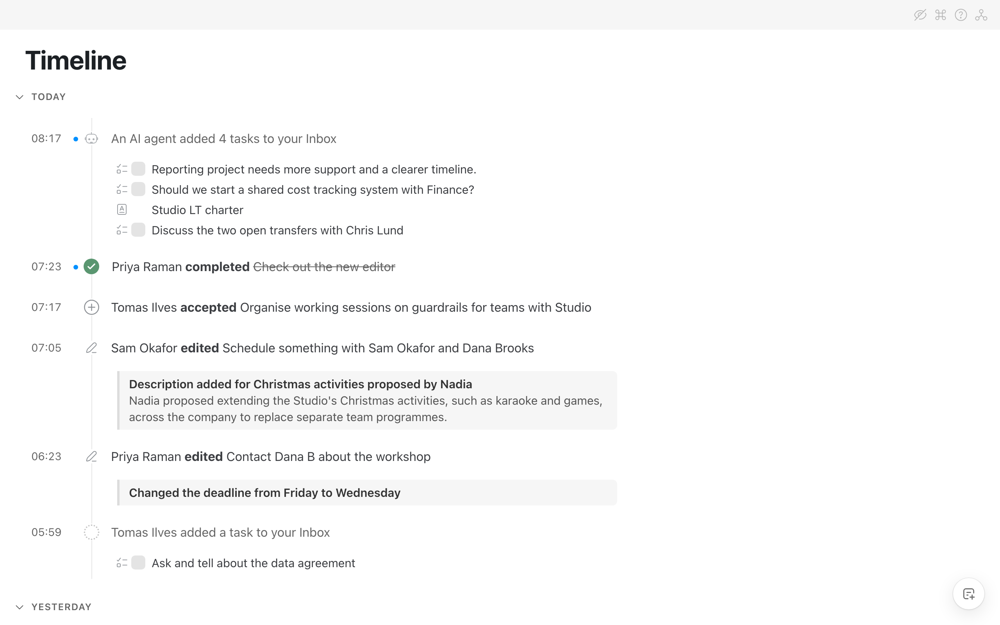
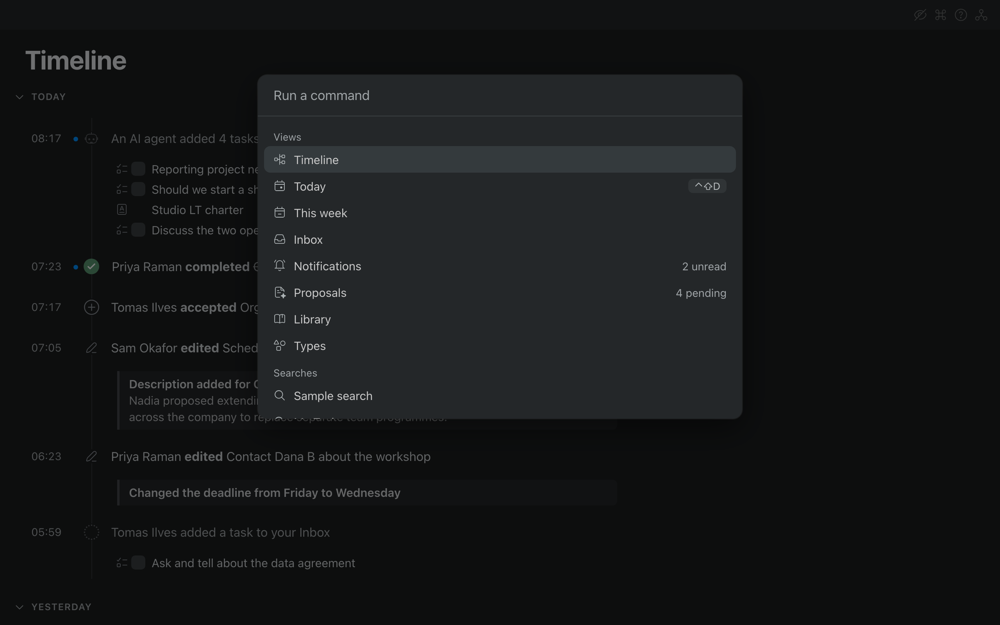
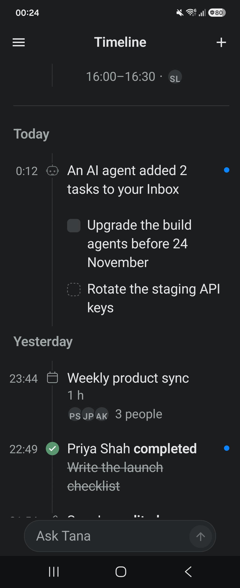
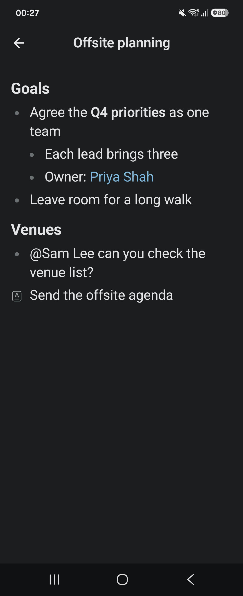

# Orbital

**[orbital.md](https://orbital.md)** · **[Manual](https://orbital.md/manual)**

Small apps for the new Tana (home.tana.inc): a keyboard-first outliner on the Mac, and the same
Timeline, saved searches and Quick Add on the iPhone and on Android. None of them is a wrapper around
the web app — they talk to Tana's platform sync directly (Connect-RPC plus Loro CRDTs), so edits are
written back as you type and changes made anywhere else arrive within a second.

On the Mac, Orbital reads the way Tana's own outliner does: every line is a node, top-level rows are
documents and their children are the document's content blocks.

It exists because a keyboard-first outline over your own tasks, meetings and notes is a different
thing from a browser tab, and because the round trip through a web view makes a list feel slow.

| Platform | Where | Built with | Status |
|----------|-------|------------|--------|
| Mac | the repository root | Electron, plain JavaScript | Released; signed, notarized and updating itself (Apple Silicon) |
| iPhone | [`ios/`](ios/README.md) | SwiftUI | Beta in TestFlight: [join it](https://testflight.apple.com/join/wgcnRVKx) on iOS 26 or later |
| Android | `android/` | Kotlin Multiplatform, Jetpack Compose | Builds and passes its tests in CI; not distributed yet (coming soon) |

There is no iPad, Windows, Linux or web version.





## What it does on the Mac

**One screen, three presets, your own searches.** Inbox, Library and Types are the same list with a
different filter on it: a kind, a status, an assignee, a text query, a window. The pills that edit
the filter also save it: Tasks, Meetings, Chats and People are saved searches in Tana, listed under
Searches in Cmd+K beside any you make yourself, and re-aimed from the same pills. Every list has
Sort and Group, remembers its choices, and caches its rows, so any page opens instantly and stays
readable while auth or sync reconnect. Home is whichever page you set. The contract is in
[docs/VIEWS.md](docs/VIEWS.md).

**An outliner, not a form.** Type anywhere. Enter splits or creates a node, Tab and Shift+Tab nest
and unnest, Backspace on an empty node removes it, Cmd+Up/Down collapse and expand, Cmd+Shift+Up/Down
move a node among its siblings, and clicking a bullet zooms in. Drag a row by its bullet to move it,
with a drop line at the level it will land on, into the page or into one of the typed fields under
the title; drag a document from a list into a page and it lands as a reference. A line that is only
a reference reads as the node it points at, with its checkbox and tags, and opens into it. `/` at
the start of a node opens the block menu (headings, lists, code, quote, divider, tables, new
documents); `@` links to another node; selecting text opens the formatting bar. Undo and redo are
CRDT-aware and local-only: Cmd+Z never rolls back someone else's edit. The full keyboard contract is
[docs/OUTLINER.md](docs/OUTLINER.md).

**Cmd+K for everything else.** Switch pages, run an action on the current node (copy link, show
in Tana, pin it to the sidebar, to today, tomorrow or a meeting, set its type, give a type an icon
and a colour, change visibility, move to a space, notify you when it changes), or act on a
multi-selection: Cmd+click rows, then mark them sensitive, add them to today's, tomorrow's or the
week's node, set a status, assign them or delete them; with nothing selected the same actions apply
to the node you are on. Cmd+Shift+K on any palette row records a hotkey for it, and refuses one the
app already uses. Cmd+S searches Tana itself, with `#task`, `#meeting`, `#space`, `#member` and
`#<Type>` filters; Cmd+F filters the rows already on screen.

**Hand a task to an agent.** Assign a node to an agent with a prompt: Tana's own AI, always there and
answering in a Tana chat on the node, or Codex or Claude Code when this Mac has them (Cmd+K "Choose
agents" switches them on and picks the default). The row wears a badge that reads the task's state and
opens it; a Claude task says so when it runs on another Mac, and @Codex or @Claude in a chat answers
on this Mac only. "Discuss with…" makes a node a discussion task with someone, and a model can read
its title to suggest who (sign in with ChatGPT, or keep the OpenAI API key you saved before; only the
title is sent, and the key stays on the machine).
"Auto-pick type" has the same model pick a node's type from each type's description and AI
instructions: a sure answer is applied, otherwise you choose from the odds.

**Create a task from its title.** Shift+Cmd+Space (or Cmd+K "Quick Add Task") asks for the title and,
if you like, one of your workflow types (arrow keys) and who it is for (Tab): press Enter and the
task is there, open and assigned to you or to whoever you picked. Where it goes and who else has it are the task's own Cmd+K rows afterwards.

**The things a day needs.** Meetings carry their times; a meeting's sidebar shows its call link,
its write-up, its pins, its outcomes and its notes, and a page's sidebar shows its fields, what
links to it and what changed. Tasks carry state, assignee and audience, and a node you watch
announces its changes in a macOS notification that says what changed, the way Tana's own Changes
panel does. Sensitive nodes are blurred for screen-sharing and toggled back with one command, and
titles you never want to see ("Lunch", "Block*") can be hidden from every list and search. What
follows you between machines and what stays local is spelled out in
[docs/SETTINGS.md](docs/SETTINGS.md): the app keeps its own settings document in Tana, mirrored in
SQLite, so a choice about your content is the same choice everywhere, while the row cache, the
window and the API key stay on the machine.

## On your phone

The phone apps are for the moments away from the desk, not a second outliner. Both open on the
Timeline — what others changed in the nodes you watch, your meetings, the tasks that landed in your
Inbox — with a side menu for your saved searches, and pull to refresh. Opening a node shows its
outline, its chat or its meeting, with who it is assigned to and who can see it; both can be changed
there, and Orbital asks to grant access when a new assignee could not see the node. A long press on a
row assigns it, moves it back to the Inbox, pins it to today, marks it sensitive or deletes it. The +
at the top right is Quick Add: a task with a title and a type, or a photo that ChatGPT reads into a
task or a note; words or an image shared to Orbital from another app open there too. Ask Tana starts a
chat, typed or dictated.

Auto-translate, sensitive marks (blurred until you shake the phone, or turn on Show sensitive items in
Settings), demo mode and the two AI models are the desktop's own, and they follow you between devices
through the same settings document in Tana. The AI features use the phone's own ChatGPT sign-in.
Editing an outline's text is the Mac's job; the phones read outlines and act on nodes.

<p>


</p>

Android has every screen the iPhone has, and on a wide window (a tablet, an unfolded phone) the menu
stays beside the page. It has been tried on a Galaxy Z Flip5 and on emulators with invented content,
but not yet signed in to a real Tana account, so reading and writing real data there is unchecked.
Tana's **Sign in with Google** may be refused inside the phones' web view, because Google does not
allow its sign-in in an embedded browser.

## Running it

### Mac

macOS on Apple Silicon, Node 22.5 or later, and a Tana account.

```sh
npm install
npm start
```

On first run, open Cmd+K and choose **Log in to Tana**: a window opens on home.tana.inc, you sign in
as usual, and the cookie session stays in the app's own partition. Everything after that is
background: the access token is refreshed before it expires, the first 100 rows of every open view are
subscribed for live updates, and a view is re-queried whenever Tana pushes a change to what it lists,
when a window regains focus more than 30 seconds after the last refresh, and every 5 minutes as a
backstop (docs/VIEWS.md §4).

Local state lives in `~/Library/Application Support/Orbital`: the SQLite row cache, cached images,
the sync peer identity and the login partition. Deleting that folder resets the app without touching
anything in Tana. An install from before the rename keeps its data: the older `tana-tasks` folder is
moved to the new name the first time the app or the CLI starts (`userdata.js`).

### iPhone

To use it, open https://testflight.apple.com/join/wgcnRVKx on the iPhone (iOS 26 or later) to join the
TestFlight beta, or Cmd+K **Install mobile app** in the Mac app and scan the code it shows with the
iPhone's camera; the same page lists Android as coming soon. To build it, you need Xcode 26 or later, [Bun](https://bun.sh) (it bundles the
engine in an Xcode build phase) and this repository's `node_modules`. [ios/README.md](ios/README.md) has
the build and install commands, the simulator's launch arguments on invented content, and the UI tests.

### Android

There is no build to install yet; to build one, you need the Android SDK with API 37, a JDK 17 or later,
[Bun](https://bun.sh) and this repository's `node_modules` (`npm install`, or `npm run modules` in a
worktree). The Gradle build bundles the phones' engine into the app itself.

```sh
cd android
./gradlew :androidApp:installDebug                # build and install on a connected phone or emulator
./gradlew :shared:jvmTest                         # the shared module's tests, its screens drawn headless
./gradlew :androidApp:connectedDebugAndroidTest   # on a device: the journeys, Back, rotation, sharing, the engine
adb shell am start -n com.dreetje.orbital/com.dreetje.orbital.android.MainActivity --ez sample true   # invented content, no Tana
```

[docs/ANDROID.md](docs/ANDROID.md) records the research behind the Android choices (the web view bridge,
sign-in, WebAssembly limits, versions), with a source for each.

## Releasing the Mac app

Mac releases are signed, notarized and published to a public repo, so the source repo can stay private
and the updater needs no token. The iPhone beta goes out through TestFlight; Android has no release yet.

```sh
npm run release            # patch; also accepts minor, major or an explicit version
```

It refuses to start on a dirty tree, then checks both credentials **before** bumping anything, since a
failure afterwards would leave a local commit and tag to undo:

- a **Developer ID Application** certificate in the Keychain, and
- a `notarytool` keychain profile that still authenticates (`xcrun notarytool store-credentials`).
  Override the profile name with `ORBITAL_NOTARY_PROFILE`.

Then it bumps the version, packages the arm64 bundle with the hardened runtime, notarizes and staples
it, validates the staple, prints the verdict Gatekeeper will give on someone else's Mac, zips the
bundle with `ditto` (which preserves both the signature and the ticket), pushes the commit and tag,
and publishes the zip as a release of this repo — override with `ORBITAL_RELEASES_REPO`. Copies up
to 0.9.1 look for updates in `foeken/orbital-releases`, so each release is mirrored there as well
(`ORBITAL_MIRROR_REPO`, empty to stop) until they have all updated once. The release notes are then
written by hand and posted in **#orbital** on Slack; the script prints that reminder last.
Signing every nested file takes a few minutes; let it finish, and never run two packager builds at
once, because the packager clears a shared temporary tree at startup and the second run breaks the
first in a way that looks like a signing bug.

The app updates itself from that public repo: it checks at launch, once a day, and from
**Check for Updates…** in the app menu, over the plain GitHub API with no token. On "Update and
Restart" it downloads the zip, and a detached shell waits for the app to quit, swaps the bundle and
reopens it. No Squirrel — its signature check cannot pass for a bundle swapped this way, and the swap
is a dozen lines ([updater.js](updater.js)).

## Development

`npm run lint` and `npm run check` must both pass before a commit, and GitHub runs them, the user
flows and both phones on every ready pull request into main, on the commit main gets ([docs/WORKFLOW.md](docs/WORKFLOW.md)). The linter is ESLint's recommended set and nothing else, no
formatter; the checks run everything offline: the SQLite cache, the SDK against a fake sync service
and a synthetic task snapshot, the renderer's auth and behaviour checks, the phones' engine bundle,
and that the iPhone's and Android's row models and glyphs have not drifted apart. Every non-trivial
change is expected to leave a check behind that fails when the logic breaks.

CI also builds the Android app and runs its tests on every pull request, and runs the iPhone's UI
tests on a simulator when `ios/` changes. Each pull request says under **Platforms** whether it
landed on the desktop, the iPhone, Android and the manual, or why it did not need to, and a check
holds those lines to the diff (`scripts/platform-check.js`; the rules are in AGENTS.md, Every
platform). The two phones mirror each other in the same pull request.

```sh
npm run lint                        # ESLint over main, sdk, scripts and the renderer
npm run check                       # all offline checks
npm run package                     # dist/Orbital-darwin-arm64/Orbital.app
npm run tana -- whoami              # the platform, without the UI
npm run icon                        # re-render build/icon.icns
node scripts/build-icons.js <dir>   # regenerate icons.js from the line icon set
node scripts/build-nucleo.js        # rebuild build/nucleo-ui.json.gz (the Set icon set) from the local Nucleo library
```

`npm run tana` is an Electron-run CLI over the same SDK: `login`, `whoami`, `search`, `get`,
`outline`, `watch`, `create`, `delete`, `set-title`, `set-state`, `fields`, `graphnode`, `edges`,
`changes`, `incall`, `caps`, `rows` and more — useful for checking what Tana actually returns before
changing code. It re-execs Electron itself and refuses inside an agent sandbox, where GUI Electron
cannot start ([docs/ELECTRON-SANDBOX.md](docs/ELECTRON-SANDBOX.md)).

A second worktree needs no second install: `scripts/modules.sh` clones the main checkout's
`node_modules` with a copy-on-write copy (a third of a second, no disk), and `check`, `start` and
`package` run it first. A fresh clone is the other case: `npm install` there also downloads the
Electron binary and renames its bundle to Orbital. The login lives in the shared
`~/Library/Application Support/Orbital`, so one sign-in serves every checkout.

Requests and their state are tracked as GitHub issues; the tracker kept before 2026-09-23 is in
[docs/TASKS-HISTORY.md](docs/TASKS-HISTORY.md).

## How it is put together

`main.js` is the Electron process boundary (windows, menu, boot, and registering each `main/` module's `ipc` table) and `main/` is what
it delegates to: shared state, rows, documents and their undo stack, the meeting hub, the views
and their refresh loop, pins, the agent handoff, the settings document.
`renderer/` with `index.html` and `styles.css` is the whole UI: twenty plain scripts sharing one
global scope, loaded in the order `index.html` lists them, no framework and no bundler. `sdk/` is a
generic, Electron-independent Tana client (graph queries, the sync stream, Loro documents, outline
operations, typed fields, chats, pins, access rules, who is in a call, change summaries);
`tana-session.js` is the login and token layer; `db.js` is the local SQLite cache and settings mirror.
A window is a shell page (`shell.html`) that lays any number of outliner pages out side by side, as
tabs or floating, with [Trellis](https://github.com/DanFessler/trellis).

The phones share one engine with each other and with the Mac: `ios/engine` bundles `sdk/`, the
desktop's `main/timeline.js` and `main/settings.js` and demo mode's masks into one script with Bun,
and each phone runs it in a hidden web view on home.tana.inc, which is also where you sign in to Tana.
SwiftUI (`ios/Orbital`) and Compose (`android/shared` for the screens and the engine bridge,
`android/androidApp` for what only Android provides: the web view host, ChatGPT sign-in, the
microphone, the shake, the photo picker and sharing) ask it for rows and draw them. Each Kotlin screen
names its Swift counterpart on its first line, so a change to one is easy to carry to the other.

Uses Trellis by DanFessler — github.com/DanFessler/trellis. Trellis is free for non-commercial use; commercial use
needs a GitHub Sponsorship or an enterprise licence, see `node_modules/@danfessler/trellis/LICENSE.md`.

Start with [AGENTS.md](AGENTS.md) for the map and the working rules, then the docs:
[VIEWS.md](docs/VIEWS.md) (the views and saved searches), [OUTLINER.md](docs/OUTLINER.md) (the UI
and keyboard contract), [PLATFORM-PROTOCOL.md](docs/PLATFORM-PROTOCOL.md) (the wire protocol, the
source of truth), [sdk/01–05](docs/sdk) (overview, data model, API reference, recipes, gotchas),
[MEETINGS.md](docs/MEETINGS.md), [CHATS.md](docs/CHATS.md), [PINNING.md](docs/PINNING.md),
[SETTINGS.md](docs/SETTINGS.md), [ios/README.md](ios/README.md), [ANDROID.md](docs/ANDROID.md) and
[VERIFICATION.md](docs/VERIFICATION.md) (what was checked against real data, and how).

## The caveat

This speaks Tana's undocumented `v1alpha1` protocol, reverse-engineered from their web client. It can
break with any deploy of theirs. When it does, the protobuf descriptors are re-extracted from the
current bundle and diffed against `sdk/proto/descriptors.js`; the how is in
[docs/PLATFORM-PROTOCOL.md](docs/PLATFORM-PROTOCOL.md).

## License

Orbital is free, and you can do pretty much anything with it: use it, change it, fork it publicly,
share it, and get paid for customising, setting up or explaining it. Built something others would
want? Send it as a pull request. Two things I ask:

- Keep the credit. Every copy and fork keeps the licence and says Orbital was originally made by me.
- Don't sell Orbital itself, changed or repackaged, as your own product.

Want to do something else? Just ask through [orbital.md](https://orbital.md). The full terms are in
[LICENSE](LICENSE); Trellis and the other dependencies keep their own licences.

Tana and its trademarks belong to Tana. Orbital is an independent project, not affiliated with or
endorsed by Tana.

If Orbital saves you time, you can chip in through [GitHub Sponsors](https://github.com/sponsors/foeken).
