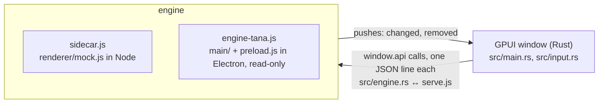

# Orbital in GPUI (spike)

A native window for Orbital drawn with [GPUI](https://gpui.rs), Zed's GPU UI framework (crates.io `gpui` 0.2.2), over
the same JavaScript that knows Tana. It asks the questions the web renderer asks (`window.api`, preload.js) of an
engine process over stdio, so the window does not know or care whether a mock or your real Tana answers.



## Running it

Rust (1.85+, edition 2024) and Node are needed. `./bundle.sh [debug|release]` builds and wraps the binary in
`target/<profile>/Orbital GPUI.app`. A GUI app cannot start inside the agent sandbox, so run it unsandboxed.

```sh
open "gpui/target/release/Orbital GPUI.app"                                   # the renderer's mock data
open --env ORBITAL_OPEN=gpui:stress "gpui/target/release/Orbital GPUI.app"    # a 5,000-row document
open --env ORBITAL_NODE="$PWD/node_modules/electron/dist/Electron.app/Contents/MacOS/Electron" \
     --env ORBITAL_ENGINE="$PWD/gpui/engine-tana.js" "gpui/target/release/Orbital GPUI.app"   # your Tana, read-only, masked
```

`ORBITAL_REAL_WORDS=1` shows your real words instead of demo mode's masks, `ORBITAL_START=timeline` opens another view,
`ORBITAL_THEME=dark` fixes the theme, and `ORBITAL_TIMING=1` logs load and key-to-frame times to stderr.

Keys: ↑↓ move, Enter opens a document or edits a row (and splits it while editing), Tab and ⇧Tab indent, ⌘Enter ticks,
⌘↑ and ⌘↓ fold, ⌘K searches and runs commands, Esc saves an edit or goes back, ⌘Z and ⇧⌘Z undo and redo, ⇧⌘L switches
the theme.

The real engine is read-only three ways: it answers only calls that read, it turns off what main/ writes while reading
(block ids on open, the settings document's merge and tidy), and the sync client refuses to send any change except to
Tana's own ephemeral live-query documents. A tick or an edit there is refused with a toast and drawn back.

## What the spike found

**The engine boundary works as it is.** `window.api` over stdio carried every read and write the window makes, and live
pushes (`outline:changed`) arrived without changes to main/ or the SDK. The real engine runs `main.js` in its check mode
with `preload.js` evaluated against the caught IPC handlers, the same route `platform-cli.js backend()` takes, so the
native window got exactly what the web renderer gets: 115 Library rows, the Timeline, documents with headings, marks,
links and checkboxes.

**It is fast where an outliner needs it to be.** Measured on an Apple M4, release build:

| | |
|---|---|
| First page drawn after launch, mock engine | 650–690 ms (Node and the mock take about 270 ms of it) |
| First page drawn after launch, your Tana | 1.7–3.0 s (Electron start and connecting to Tana) |
| Key to frame on a 5,000-row document | median 7 ms, p90 8.6 ms, worst 35 ms in 40 presses |
| Same, before the page was a virtual list (debug) | 110–350 ms |
| Window process memory | 92 MB, 126 MB with 5,000 rows |
| Binary | 6.6 MB (5.0 MB stripped), against 252 MB for Electron.app |
| Cold build | about 1.5 min (11 CPU-minutes); incremental 5 s |

The binary size is not yet the shipped size: the real engine still runs inside Electron, because the Tana session is a
cookie in Electron's partition (tana-session.js). Dropping Electron means signing in natively (a WKWebView, as the
iPhone app does) and running the engine on a JavaScript runtime the app carries, or porting the SDK to Rust (Loro is a
Rust library; the protocol is Connect over protobuf descriptors).

**Text editing is the cost of a real port.** GPUI ships a GPU text system and an IME-aware input handler, and the
spike's row editor (`src/input.rs`, GPUI's own input example trimmed) handles dead keys and marked text. It edits one
line that does not wrap, and it writes plain text, so a row with bold or a mention loses its marks once edited. Zed's
editor is not on crates.io and is built for code. Wrapping, rich marks, mentions, the @ and / toolbars, selection
across rows, tables, drag and images (renderer/edit.js, toolbar.js, table.js, drag.js, upload.js and the rest of
12,300 lines of renderer) would all be written again.

**GPUI exposes no accessibility tree for its content.** VoiceOver, and Computer Use while testing, see the window's
traffic lights and nothing inside it. For a Mac app this is a real gap, and it is not one the spike can close.

Smaller things learned along the way:

- The crates.io GPUI needs Xcode's Metal Toolchain to build its shaders; the `runtime_shaders` feature compiles them at
  start instead, which is what this crate uses. 0.2.2 is a snapshot of a fast-moving API; a real port would pin a Zed revision.
- A long page has to be GPUI's `list` (virtual, measured rows). A row being edited must be kept rendered while focused
  (`splice_focusable`): text typed into a row that is not painted is dropped.
- Enter must draw the new row and its caret before the engine answers, then adopt the engine's id (`adopt`): waiting for
  the round trip lost the first keys typed after Enter.
- Synthetic Unicode key events (what remote-control and text-expander tools send) never reach the input; real typing,
  dead keys and the IME do.
- Trellis panes and tabs, the manual's capture pipeline and `npm run flows` are all built on Chromium and would need GPUI
  counterparts (GPUI has a test context for the latter).
